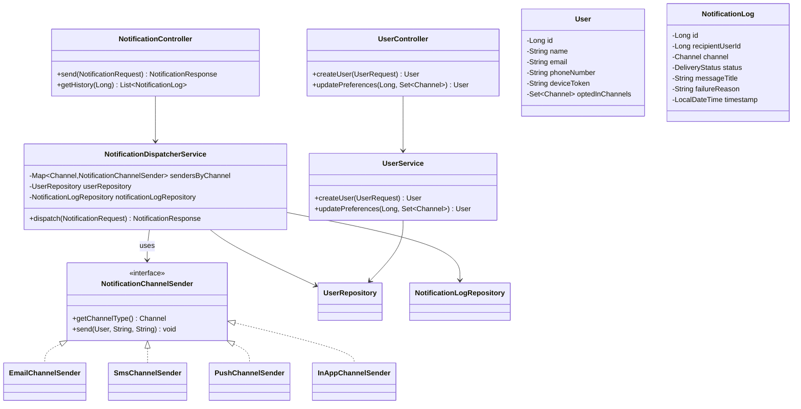
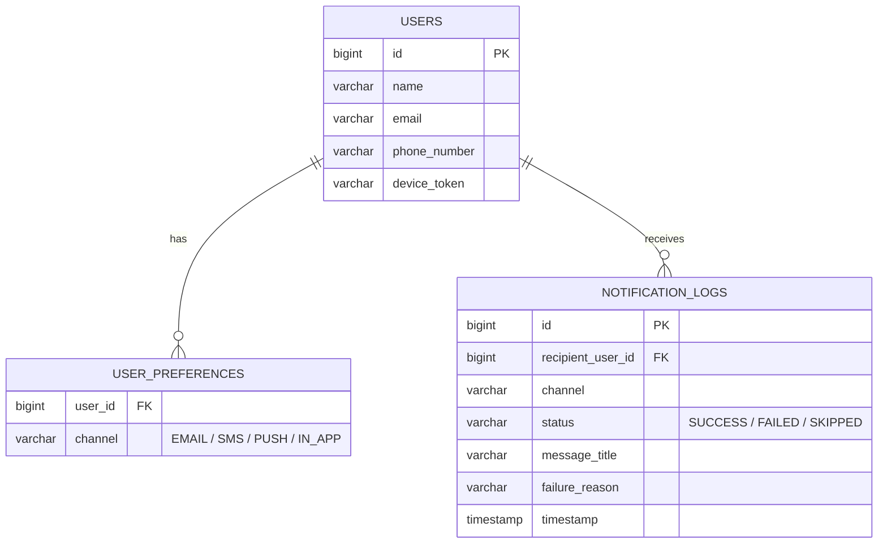

# Unified Notification Hub

A Spring Boot backend service that acts as a central hub for outbound communications,
routing messages to a user's preferred channels (Email, SMS, Push, In-App) while strictly
respecting their opt-in preferences, and logging every attempt for auditing.

## Tech Stack
- Java 17, Spring Boot 3.2.5
- Spring Web, Spring Data JPA, Bean Validation
- H2 in-memory database
- JUnit 5 + Mockito for testing

## How to Run
```bash
mvn spring-boot:run
```
App starts on `http://localhost:8080`. Three demo users (ids `1`, `2`, `3`) are seeded
automatically on startup with different preferences (see `DataSeeder.java`).

H2 console: `http://localhost:8080/h2-console` (JDBC URL: `jdbc:h2:mem:notificationdb`, user `sa`, blank password)

## Architectural Approach

### The core design problem
"Route a message to N different channel types, where each channel works completely
differently (an email needs an address, SMS needs a phone number, push needs a device
token) — without the routing logic turning into a long if/else chain that has to change
every time a new channel is added."

### The solution: Strategy Pattern + Spring's dependency collection
Every channel implements one common interface:

```java
public interface NotificationChannelSender {
    Channel getChannelType();
    void send(User recipient, String title, String body);
}
```

`EmailChannelSender`, `SmsChannelSender`, `PushChannelSender`, and `InAppChannelSender` each
implement it independently, as `@Component` beans. The dispatcher service asks Spring for
**all** beans implementing this interface (`List<NotificationChannelSender>`) and builds a
`Map<Channel, NotificationChannelSender>` from them at startup.

This means **adding a 5th channel (e.g. WhatsApp) requires writing exactly one new class** —
zero changes to the dispatcher, controller, or routing logic. This is the Open/Closed
Principle in practice: open for extension, closed for modification.

### Request flow
1. `POST /api/notifications` hits `NotificationController`, which validates the payload
   (`@Valid` — userId, title, body required, channels list non-empty).
2. `NotificationDispatcherService` loads the user and, **for every requested channel**:
   - Checks the user's `optedInChannels` preference set **first** — if they haven't opted
     in, the channel is marked `SKIPPED` and the sender is **never called**, even if the
     original request asked for it.
   - If opted in, the matching `NotificationChannelSender` is invoked. Success → `SUCCESS`.
     An exception (e.g. missing phone number) → caught and logged as `FAILED`.
3. Every outcome (`SUCCESS`/`FAILED`/`SKIPPED`), for every channel, is persisted to
   `NotificationLog` with a timestamp — this is the audit trail.
4. The API responds with a per-channel breakdown of what happened.

### Why preferences are modeled with `@ElementCollection`
Rather than hand-writing a separate `UserPreference` entity + repository, `User` has a
`Set<Channel> optedInChannels` annotated `@ElementCollection`. Spring Data JPA automatically
creates a `user_preferences` join table (`user_id`, `channel`) for this — satisfying the
"preferences table" requirement with less boilerplate, while still being a real normalized
table you can see in the H2 console.

## Build, Run, and Test

### 1. Build the project
```bash
mvn clean install
```
This downloads dependencies, compiles the code, and runs the test suite. A successful
build ends with `BUILD SUCCESS`.

### 2. Run the application
```bash
mvn spring-boot:run
```
Wait for the console to show `Started NotificationHubApplication in X seconds` and
`Tomcat started on port(s): 8080`. The app is now live at `http://localhost:8080`.
Three demo users (ids `1`, `2`, `3`) are seeded automatically on startup — see
`DataSeeder.java` for their exact preferences.

### 3. Test the endpoints

You can test every endpoint with **either cURL** (copy-paste into any terminal) **or Postman**
(copy the same details into a new request). Both are shown below for each endpoint.

---

**a) Get a user's profile** (confirms the demo data seeded correctly)

cURL:
```bash
curl http://localhost:8080/api/users/1
```
Postman: `GET` request to `http://localhost:8080/api/users/1`, no body needed.

---

**b) Create a new user**

cURL:
```bash
curl -X POST http://localhost:8080/api/users \
  -H "Content-Type: application/json" \
  -d '{"name":"Anjali","email":"anjali@test.com","phoneNumber":"9999999999","deviceToken":"device-abc","optedInChannels":["EMAIL","IN_APP"]}'
```
Postman: `POST` to `http://localhost:8080/api/users` → Body tab → raw → JSON → paste:
```json
{
  "name": "Anjali",
  "email": "anjali@test.com",
  "phoneNumber": "9999999999",
  "deviceToken": "device-abc",
  "optedInChannels": ["EMAIL", "IN_APP"]
}
```

---

**c) Update a user's channel preferences**

cURL:
```bash
curl -X PUT http://localhost:8080/api/users/1/preferences \
  -H "Content-Type: application/json" \
  -d '["EMAIL","SMS"]'
```
Postman: `PUT` to `http://localhost:8080/api/users/1/preferences` → Body → raw → JSON → `["EMAIL","SMS"]`

---

**d) Send a notification (the unified endpoint — this is the core feature)**

cURL:
```bash
curl -X POST http://localhost:8080/api/notifications \
  -H "Content-Type: application/json" \
  -d '{"userId":2,"title":"Order Delivered","body":"Your order has been delivered.","channels":["EMAIL","SMS","PUSH","IN_APP"]}'
```
Postman: `POST` to `http://localhost:8080/api/notifications` → Body → raw → JSON:
```json
{
  "userId": 2,
  "title": "Order Delivered",
  "body": "Your order has been delivered.",
  "channels": ["EMAIL", "SMS", "PUSH", "IN_APP"]
}
```
Expected response (user 2 — Priya — has NOT opted into SMS, so it's SKIPPED even though requested):
```json
{
  "userId": 2,
  "results": [
    { "channel": "EMAIL", "status": "SUCCESS", "detail": null },
    { "channel": "SMS", "status": "SKIPPED", "detail": "User has not opted into this channel" },
    { "channel": "PUSH", "status": "SUCCESS", "detail": null },
    { "channel": "IN_APP", "status": "SUCCESS", "detail": null }
  ]
}
```
Also check the terminal running the app — you'll see `[EMAIL] To: ...`, `[PUSH] Device: ...` etc.
printed by the mock channel senders.

---

**e) View notification history for a user (the audit trail)**

cURL:
```bash
curl http://localhost:8080/api/notifications/history/2
```
Postman: `GET` request to `http://localhost:8080/api/notifications/history/2`

---

**f) Test a validation failure** (missing required field → should return `400 Bad Request`)

cURL:
```bash
curl -X POST http://localhost:8080/api/notifications \
  -H "Content-Type: application/json" \
  -d '{"title":"Missing userId and channels"}'
```

---

**g) Test a not-found case** (non-existent user → should return `404 Not Found`)

cURL:
```bash
curl http://localhost:8080/api/users/999
```

### 4. Run the automated test suite
```bash
mvn test
```
This runs `NotificationDispatcherServiceTest` (5 scenarios covering routing, preference
skipping, and failure handling) and `NotificationControllerValidationTest` (validation).
A successful run shows `Tests run: 6, Failures: 0, Errors: 0`.

### 5. (Optional) Inspect the database directly
Visit `http://localhost:8080/h2-console` while the app is running.
JDBC URL: `jdbc:h2:mem:notificationdb`, user: `sa`, password: *(blank)*.
Run `SELECT * FROM NOTIFICATION_LOGS;` to see every dispatch attempt logged.

## Class Diagram



## Entity-Relationship Diagram



## Running the Tests
```bash
mvn test
```
`NotificationDispatcherServiceTest` (unit, Mockito-mocked dependencies) covers:
- A channel the user has NOT opted into is skipped and the sender is never invoked
- A channel the user HAS opted into dispatches successfully
- A sender throwing an exception is caught and recorded as `FAILED`
- Multiple channels with mixed outcomes in a single request
- Every attempt (success, failure, or skip) is persisted to the log

`NotificationControllerValidationTest` confirms malformed requests are rejected with 400
before reaching the dispatcher.

## Assumptions Made
- "Mock providers" means simulating dispatch via console logging rather than integrating
  real third-party providers (Twilio, SES, FCM) — no external API keys/accounts needed to run this.
- A channel requested but not opted into is marked `SKIPPED` (not silently ignored) so the
  caller always gets visibility into what happened and why.
- In-App notifications have no external contact-info dependency, so they cannot fail due to
  missing contact details the way Email/SMS/Push can.

## What I'd Add With More Time
- `@Transactional` around the dispatch-and-log flow for atomicity
- Pagination on the history endpoint
- Async/queue-based dispatch (e.g. via a message broker) instead of synchronous calls, so
  one slow channel doesn't block the others
- Retry logic with backoff for `FAILED` deliveries
- Swagger/OpenAPI documentation
